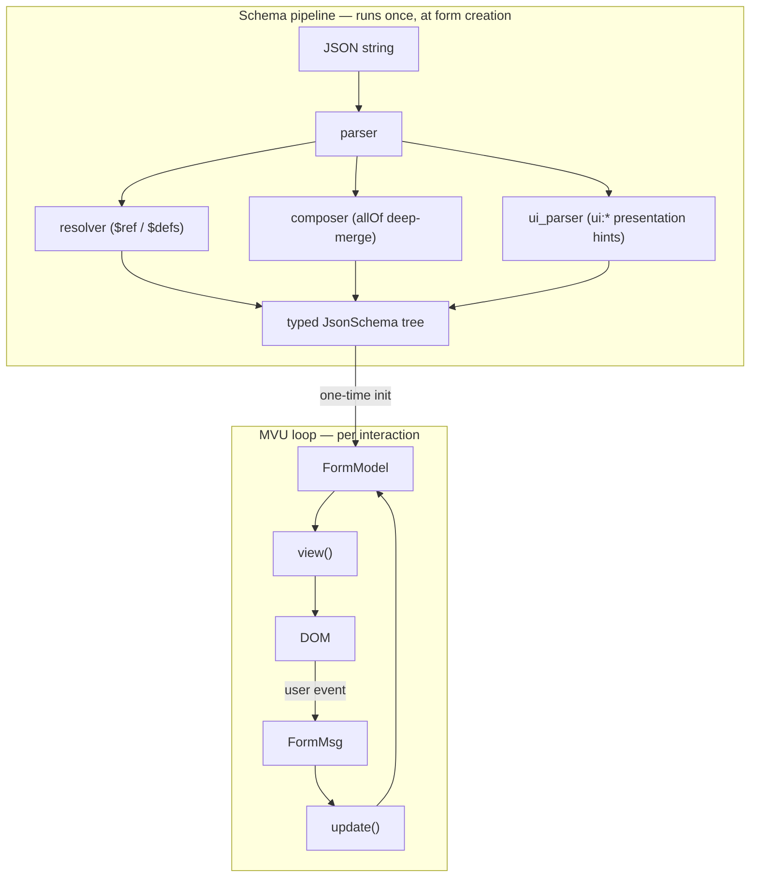

# Architecture

Formosh is a [Lustre](https://hexdocs.pm/lustre/) application, so it follows
Lustre's **Model-View-Update (MVU)** discipline strictly: state lives in one
immutable `FormModel`, every state change flows through an `update` function
that takes a message and returns a new model, and the view is a pure
function of the model. The schema-parsing pipeline that produces the model
in the first place is a separate concern that runs once up front.

## The three layers

The schema pipeline runs once when the form is created (or when the schema
attribute changes on the web component). The MVU loop then runs on every
keystroke, array add/remove, and submit attempt.

## Where each concern lives

The codebase is organized so that each MVU layer, plus the schema pipeline
and the widget family, has its own directory. Here is the full map.

### Top-level entry points

| File | Role |
|------|------|
| `src/formosh.gleam` | Public API: `from_json_string`, `config`, `from_config`, the `with_*` builders, `get_values`. Assembles the MVU app from the layers below. |
| `src/formosh/component.gleam` | The `<formosh-form>` web component: attribute listeners, custom events, and the `component.element(...)` Lustre helper. |
| `src/formosh/cdn.gleam` | CDN bundle entry point. |

### Schema pipeline — `src/formosh/schema/`

Runs once at form creation. Produces a typed `JsonSchema` tree the MVU loop
can render without re-parsing.

| Module | Responsibility |
|--------|----------------|
| `types.gleam` | The `JsonSchema`, `SchemaProperty`, `Value`, `FieldType`, `Widget`, and `ParseError` types. The shared vocabulary for the whole library. |
| `parser.gleam` | Decodes a JSON string into a `JsonSchema` tree; orchestrates the pipeline below. |
| `resolver.gleam` | Resolves `$ref` against `$defs` / `definitions` using JSON Pointer syntax; detects and rejects circular refs. |
| `composer.gleam` | Deep-merges `allOf` members into their parent node at parse time (properties, required, bounds, conditionals); also normalizes `anyOf` (null members → `nullable`, single survivor merges into the node, 2+ survivors stay a union). |
| `conditional_resolver.gleam` | Re-evaluates `if`/`then`/`else` against the **current** values — this is the runtime half of conditionals (the parse-time half just records the rules). |
| `properties.gleam` | Helpers for walking and querying the property tree. |
| `ui_parser.gleam` / `ui_schema.gleam` / `ui_resolver.gleam` | The UiSchema subsystem: presentation hints (`ui:widget`, `ui:order`, placeholders, help text) parsed separately from the data schema. |
| `serializer.gleam` | Round-trip a parsed `JsonSchema` back to JSON. |
| `validator.gleam` | Schema-driven per-field validation (required, length, bounds, format). |

The split between `composer` (parse-time `allOf`) and
`conditional_resolver` (runtime `if/then/else`) is the most important
architectural fact about the schema layer — see
[Parser](../internals/parser.md) and [Visibility](../internals/visibility.md).

### MVU core — `src/formosh/form/`

| Module | Responsibility |
|--------|----------------|
| `model.gleam` | The `FormModel` record, `FormMsg` variants, `SubmitConfig`, and the `init_*` constructors. The single source of truth for form state. |
| `update.gleam` | Pure `update(model, msg) -> #(model, effect)`. Field edits, array add/remove/move, touch tracking, submit flow. |
| `view.gleam` | Pure `view(model) -> Element(msg)`. Delegates per-field rendering to `fields/field_dispatcher`. |
| `visibility.gleam` | Computes the set of hidden paths (hidden widgets, suppressed readonly). Drives the submit gate. |
| `union_resolver.gleam` | Resolves which `anyOf` member is "active" for a field path (`FormModel.selected_branches`, inferred from the value when unset) and materializes it into the node, so every walker (render, validate, visibility, defaults) sees a single effective schema. |
| `path.gleam` | `FieldPath` — `PropertySegment` / `ArraySegment` lists for addressing any value in the tree. |
| `defaults.gleam` | Default-value hydration, `ensure_min_items` for arrays. |
| `json_utils.gleam` | `Value` ↔ `json.Json` conversions. |
| `widget_msg.gleam` | Widget-specific message types (swipe-review, image upload). |

### Widgets — `src/formosh/fields/`

One module per widget family, all funnneled through one dispatcher:

| Module | Renders |
|--------|---------|
| `field_dispatcher.gleam` | **Single entry point** for any field at any depth. Picks the widget and wraps it with error/touched/readonly state. |
| `string_field.gleam` | Text, textarea, email, url, date, time, password, date-time (text), enum radios/select. |
| `number_field.gleam` | Number input (with `step` from `multipleOf`). |
| `boolean_field.gleam` | Yes/No radios / toggle. |
| `array_field.gleam` | Dynamic list with add/remove/move controls. |
| `array_collapse.gleam` | Pure collapse-completed logic for `array_field.gleam`: `ui:options` parsing, the completed predicate, summary-text assembly. No Lustre dependency, mirroring the `swipe_review` / `swipe_review_field` split. |
| `object_field.gleam` | Nested fieldset. |
| `union_field.gleam` | Branch chooser for a 2+-member `anyOf` (radio/select) plus the active branch's own widget beneath it. |
| `image_field.gleam` | Image upload widget. |
| `readonly_field.gleam` | Static label→value summary (review mode). |
| `value_display.gleam` | Value→display-text helpers (label resolution, `oneOf` enum-to-title, password masking) shared by `readonly_field.gleam` and `array_field.gleam`'s collapsed-row summaries. |
| `swipe_review_field.gleam` / `swipe_review.gleam` | The `ui:widget: "swipe-review"` tap-based zone burndown. |
| `field_common.gleam` | Shared rendering context (`FieldRenderCtx`) and helpers. |

### Validation — `src/formosh/validation/`

| Module | Responsibility |
|--------|----------------|
| `error.gleam` | `ValidationError` type — field path + message + rule. |
| `messages.gleam` | Human-readable message templates per rule. |
| `field_requirements.gleam` | Computes which fields are required (handles conditionals). |
| `cross_validator.gleam` | Pluggable cross-field validator (`with_validator`) for rules JSON Schema can't express. |

### FFI — `src/formosh/ffi/`

JavaScript interop for things Gleam can't reach directly (console logging,
dynamic object manipulation, image upload, the JS-side custom validator
bridge). Each `.gleam` file has a matching `_ffi.mjs`.

## Three ways to ship the same engine

The MVU core is identical in all three deployment modes — only the shell
differs:

1. **Library** (`formosh.from_config` / `from_json_string`) — you get a
   `lustre.App` and `lustre.start` it yourself. Covered in
   [Quickstart](../guides/quickstart.md).
2. **Web Component** (`component.register` → `<formosh-form>`) — Lustre's
   component layer (`lustre.component` + `lustre.register`, a client-side
   custom element) wraps the same MVU app and exposes attributes +
   custom events. Covered in [Web Component](../guides/web-component.md).
3. **Lustre component** (`component.element([...])`) — embed inside another
   Lustre app without the custom-element ceremony.

## Where to go next

- **State shape and path addressing** → [Model](../internals/model.md)
- **How a field edit flows through `update`** → [Update](../internals/update.md)
- **The parse pipeline in detail** → [Parser](../internals/parser.md)
- **Conditional resolution** → [Visibility](../internals/visibility.md)
