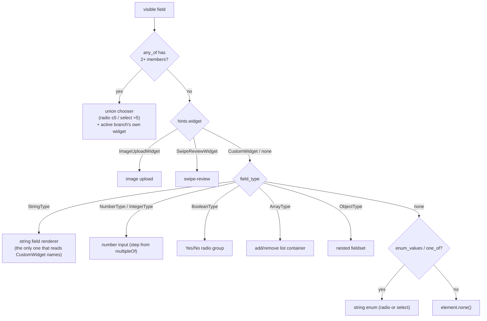
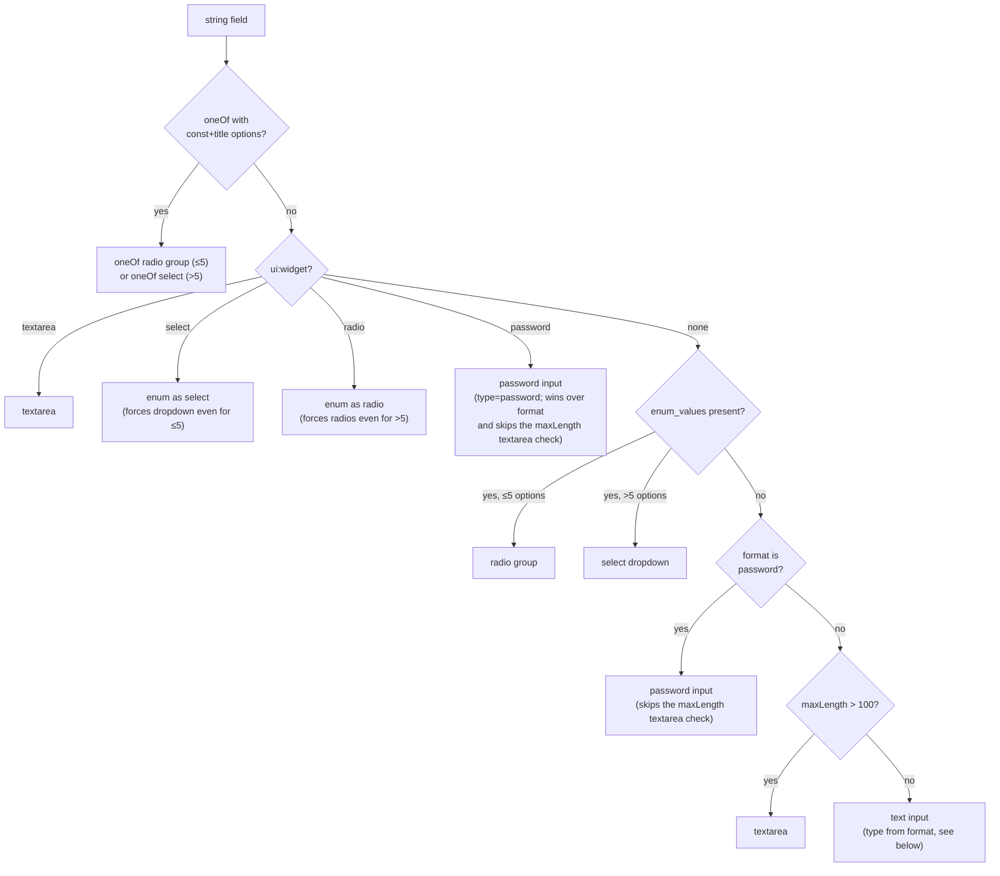

# Widget Selection

Formosh does not ask you to declare a widget per field. It picks one
automatically from the schema node's `type`, `enum` / `oneOf`, `format`,
and constraints. This page documents the decision tree and the two override
mechanisms (`ui:widget`, `x-widget`).

> **Source of truth.** The dispatcher is `render_widget` in
> `src/formosh/fields/field_dispatcher.gleam`; per-type logic is in
> `src/formosh/fields/string_field.gleam` and siblings. The merge of
> `ui:widget` and `x-widget` into a single `RenderHints` record happens in
> `src/formosh/schema/ui_resolver.gleam`.

## Selection priority

Hidden fields are filtered out *before* the dispatcher runs (the
suppression walker in `form/visibility` — the field still validates and
gates submit). For everything visible, `render_widget` decides:



Four consequences of this order:

- A 2+-member `any_of` **wins over everything else**, including
  `ImageUploadWidget` / `SwipeReviewWidget` hints on the same node — the
  `any_of` check runs before `hints.widget` is even inspected. See
  [Union chooser](#union-chooser-anyof-2-branches) below.
- `ImageUploadWidget` and `SwipeReviewWidget` overrides **always win** over
  the type-derived widget.
- `CustomWidget` names do **not** short-circuit dispatch — they ride along
  into the type-based renderer, and only the **string** renderer reads them
  (`"textarea"`, `"select"`, `"radio"`, `"password"`).
  `ui:widget: "textarea"` on a number field is silently ignored.
- If a property has no `type` but does have `enum` / `oneOf`, it still
  renders as a string enum (the fallback branch is how typeless enums work).

## String field rendering

Strings have the richest sub-decision, because `format`, `enum`, `oneOf`,
and `maxLength` all compete. From `string_field.render` →
`render_string_or_enum`:



### HTML input type from `format`

When a string renders as a plain `<input>`, its `type` attribute comes from
`StringFormat` (`string_field.get_input_type`):

| `format` | `<input type=...>` |
|----------|---------------------|
| `email` | `email` |
| `url` or `uri` | `url` |
| `date` | `date` — native picker |
| `time` | `time` — native picker |
| `password` | `password` — masked |
| `date-time` | `text` — **deliberately not wired**, see below |
| `uuid`, custom, none | `text` |

The typed inputs are what get you the mobile-optimised keyboard and, for
`date` / `time`, the browser's native picker. `password` only masks the
on-screen input — see [UiSchema § Password
masking](ui-schema.md#password-masking) for why that isn't a security
boundary.

`format: "date-time"` stays a text input on purpose. RFC 3339 `date-time`
requires a UTC offset (e.g. `2024-03-15T09:30:00Z`); HTML `datetime-local`
forbids one. A browser given a non-conforming value renders the input
**blank** rather than raising, so wiring it would silently empty the field
for every backend that emits correct RFC 3339 — which is most of them.
`DateTimeFormat` and its `get_input_type` mapping therefore remain
unreachable from a parsed schema. See `ROADMAP.md`.

> **Data contract.** `<input type="date">` accepts only `YYYY-MM-DD` and
> `<input type="time">` only `HH:mm[:ss[.SSS]]` (seconds and fractional
> seconds are both optional). A value outside that shape renders as an
> empty input with no console error. If your backend sends a
> full timestamp for a `format: "date"` field, normalise it before passing
> it as `initial-values`.
>
> **On a required field this silently blocks submission.**
> `input_attributes` (`field_common.gleam`) sets `required` on every input
> regardless of format, and the `<form>` carries no `novalidate`
> (`form/view.gleam`). An empty `<input type="date" required>` — which is
> what you get here — fails the browser's own constraint validation and
> refuses to submit, while formosh's validator still sees the original
> non-conforming string in `model.values`, considers the field satisfied,
> and leaves **Submit enabled**. What you'll observe: Submit appears
> enabled, but clicking it does nothing and formosh renders no error. Same
> class of problem as the hidden-required-field case documented in
> `CLAUDE.md` (search `hidden_blocks_warn`) — an otherwise-invisible cause
> blocking submit — though there is currently no equivalent warning for
> this one. Remedy: normalise to `YYYY-MM-DD` (`time`: `HH:mm[:ss[.SSS]]`)
> before passing the value as `initial-values`.

**String-constraint attributes still apply, even though HTML ignores them
on `date`/`time`.** `get_string_constraints_attributes`
(`string_field.gleam`) emits `minlength` / `maxlength` / `pattern`
unconditionally — but the `date` and `time` input types ignore all three
per the HTML spec. A `pattern`-constrained `format: "date"` field
therefore loses the browser-side pre-submit blocking it had as
`type="text"`. Formosh's own validator still enforces `pattern` (see
[Schema Keywords](schema-keywords.md#string-constraints)), so nothing
goes unvalidated — only the earlier, native feedback does.

#### Known limitation when editing a typed date

Clearing a single segment of an already-typed date (e.g. the day, to fix a
typo) can silently stop the field from accepting further digits, leaving
it empty with no visible cause. Typing a date from scratch, and clearing
the field entirely, both work fine — only an in-place edit of one segment
triggers it.

This is inherent to the controlled-input pattern, not a Formosh bug:
verified against a bare, framework-free `<input type="date">` with no
library involved. After a segment is cleared, the composed value is
momentarily `""`; writing that `""` back into the element — which a
controlled input does on every render — resets the browser's internal
per-segment edit state, so the next keystrokes are silently dropped.
Formosh's `input_attributes` (`field_common.gleam:196-216`) sets
`attribute.value(value)` on every render like any other controlled field,
so it inherits the same behavior.

**Workaround:** clear the whole field and retype it, rather than editing a
single segment in place.

## Number fields

A single number input. If `multipleOf` is set, it becomes the input `step`
attribute (with the tolerant `1e-8` comparison applied during validation —
see [Schema Keywords](schema-keywords.md#number-constraints)). `minimum` /
`maximum` / `exclusiveMinimum` / `exclusiveMaximum` are enforced but do
**not** become HTML attributes (validation runs in the update loop, not in
the browser).

## Boolean fields

Rendered as a Yes/No radio group, not a checkbox — the explicit No matters
for tri-state clarity. (A toggle renderer exists in `boolean_field.gleam`
but is not yet reachable via `ui:widget` — see `ROADMAP.md`.)

## Array fields

A list container with three optional controls, each gated by constraints
and UiSchema flags:

| Control | Shown when |
|---------|-----------|
| **Add** | `addable` (default true) **and** below `maxItems` (if set) |
| **Remove** | `removable` (default true) **and** above `minItems` (if set) |
| **Move up/down** | `orderable` (default true) **and** more than one row |

Rows auto-create up to `minItems` (with item-field defaults applied). Array
items can themselves be objects or arrays — nesting to any depth — so the
container recurses through the same dispatcher. (Collapsing completed rows,
below, is narrower: only object-shaped rows ever qualify.)

### Collapsing completed rows

Opt in per array via `ui:options` on that array node —
[`collapseCompleted` / `collapseCompletedLabel` /
`summaryFields`](ui-schema.md#collapse-completed-array-rows) — **and** the
array must not be read-only; the two together gate the *entire* feature,
not just the header below. With either one missing, an array renders
exactly as described above: no toggle, no progress, no summary, nothing in
this section applies.

When both hold, a header renders above the rows: a toggle checkbox plus a
`"{completed} / {total}"` progress count. The header renders even while
the user has switched collapsing off — it's the only control that can
switch it back on — but switching it back on discards every row the user
had individually reopened, so re-enabling is a real "collapse everything
again" action, not a no-op.

A row collapses only when all three hold:

- it has at least one non-empty own field,
- array-item validation reports no error at its index, and
- no recorded error in the form's error map falls under its path.

While collapsing is switched on, a completed row always renders its
summary as a real `<button>`, in **both** the collapsed and expanded
state — clicking it toggles between them (`aria-expanded` reflects which),
and only the row's field container actually hides. Switching collapsing
off removes every summary button outright, regardless of completion — but
the header's progress count keeps counting completed rows either way,
since it depends only on `collapseCompleted`/read-only, not on the toggle.

Three consequences follow directly from the predicate above:

- **Only object-shaped rows can ever collapse.** The first condition's
  "non-empty own field" check only understands an object row — it walks
  the row's own fields to look for one. An array whose `items` is a bare
  scalar, or itself another array, never collapses, no matter how the
  option is configured.
- **A row whose fields are all optional stays expanded until something is
  filled in.** An empty row has no non-empty field, so it can't collapse no
  matter how loosely its schema constrains it — by design, not a bug: fill
  something in to see it collapse. Marking a row field `required` does not
  help, at either stage: a still-empty row already fails the first condition,
  and once the row is partly filled the unsatisfied required field contributes
  a `required` validation error that fails the second — pinning the row open
  either way.
- **A freshly added row always renders expanded**, even one whose item
  schema is all-optional-with-defaults and so satisfies "completed" the
  instant `AddArrayItemPath` builds it — without this, clicking "Add" would
  immediately collapse the row the user just asked to fill in. Rows a
  `minItems` top-up auto-creates are **not** force-expanded this way; they
  render collapsed or expanded purely from the predicate above, same as any
  other row.

A completed row whose `summaryFields` resolve to nothing to show (every
named field blank, or a lone boolean that's `false`) falls back to
rendering its 1-based row number instead of an empty button — an empty
button would have no visible text and no accessible name, a dead end back
into the row.

A field the expanded row itself would hide — `ui:widget: "hidden"`, or
`readOnly` while `show_readonly_fields` is off — contributes nothing to the
summary either, named explicitly or picked up by the default: collapsing a
row never shows a value its expanded state would not.

**Known gap.** The third condition trusts `model.errors` as the complete
record of "something's wrong in this row" — it isn't, always. A
cross-field validator's error keyed on a path that only a per-row
conditional reveals (e.g. `zones.[3].lesions.[0].length_mm`, where
`lesions` exists only once *that* row's own `affected` is true) is dropped
by `filter_cross_error` before it ever reaches `model.errors`: that check
resolves the path against the array's raw, unresolved item schema — one
shared template for every row — not against that row's own resolved
conditionals. Such an error neither blocks submit nor holds the row open.
Schema-level validation (the second condition above) doesn't have this
gap — it resolves each row's own conditionals before checking — so this
only affects a custom `with_validator` cross-validator's own error paths.

## Object fields

A nested `<fieldset>` with one labelled child per property. Child order is
preserved from the schema (`properties` is a `List`, not a `Dict`) but can
be overridden via `ui:order`. `readOnly` fields inside the object are
hidden unless `show_readonly_fields` is on.

## Union chooser (`anyOf`, 2+ branches)

A node whose `anyOf` survives composer normalization with 2+ non-null
members (see [Schema Keywords](schema-keywords.md#composition)) renders a
branch chooser (`union_field.render`) ahead of everything else in the
selection priority above. The chooser follows the same ≤5-radio / >5-select
threshold as `enum`, and takes the same override: `ui:widget: "select"` or
`"radio"` on the union's own path forces the style. Each option's label is
the branch's `title` — a `$ref` member without its own title inherits the
referenced `$defs` title — falling back to the capitalized JSON type name,
then `"Option N"` (1-based).

Picking a branch dispatches `SelectUnionBranchPath`. Switching to a
**different** branch clears the field's previous value, applies the new
branch's own defaults (scoped to that field's subtree only — other fields
elsewhere in the form are never re-hydrated), and re-renders that branch's
widget beneath the chooser through the same `field_type` dispatch as any
other field — so a branch can itself be an object, array, or nested union.
Inside an array row, switching a row's union resets only that row's value
(in place, not by removing the row) so sibling rows keep their index.
Re-selecting the branch that is **already active** — whether explicitly
chosen before or only active by inference — is a no-op: values, errors, and
touched state are left exactly as they were (a checked radio's `on_click`
fires even without a change, so this guards against silently wiping the
field on every redundant click).

With no explicit selection, the active branch is inferred from the current
value: first branch whose type matches (scalars), first branch whose
declared properties overlap the value's keys (objects), else branch 0. On
initial load, `apply_answers` (swipe-review), and component
re-initialization this inference is recomputed fresh every time and never
stored. A user edit (`UpdateFieldPath`/`ClearFieldPath`) inside an inferred
branch persists that inference the first time it fires, so clearing the
field that drove the inference doesn't snap the chooser back to branch 0.

A single non-null member alongside `{"type": "null"}` never reaches this
widget: composer normalization already collapsed it into a plain nullable
field before `field_dispatcher` sees it (see
[Web Component](../guides/web-component.md#nullable-fields) for what that
means for submission). A **bare** `anyOf` directly as an array's `items`
schema (no object wrapper) does not render a chooser — wrap the union in an
object property instead.

## Read-only (review) mode

When the whole form is in review mode (`read-only="true"` on the web
component — there is no library-side builder for it), rendering switches wholesale to
`readonly_field`: enums show their label, booleans show Yes/No, nested
objects render as groups, arrays of flat objects render as **tables**, and
`password`-format or `ui:widget: "password"` fields show a fixed
`••••••••` mask instead of the stored value (an empty or unset password
still falls through to the usual `—`, like any other blank field) —
presentational only, same caveat as the edit-mode masking above.
Submit/Reset are hidden. See [Styling](../guides/styling.md) for the
`readonly-*` part names.

## Override mechanisms

Two ways to force a widget other than the auto-selected one. Both produce
a `Widget` value that the dispatcher checks first.

### `ui:widget` (UiSchema) — recommended

Set `ui:widget` in the [UiSchema](ui-schema.md) parallel tree. This is the
primary mechanism from v0.7 onward and separates presentation from the
data schema:

```json
{
  "ui:widget": "textarea",
  "ui:placeholder": "Describe the issue…",
  "ui:help": "Be specific."
}
```

Recognised values: `"image-upload"`, `"swipe-review"`, `"hidden"`,
`"textarea"`, `"select"`, `"radio"`, `"password"`. Unknown values fall
through as `CustomWidget(raw)` so you can prototype without a parser
change.

### `x-widget` (schema node) — deprecated fallback

The same idea as an extension field directly on the JSON Schema node:

```json
{ "type": "string", "x-widget": "textarea" }
```

Still works and is merged into the same `RenderHints.widget` slot, but
**prefer `ui:widget`** for new schemas — it keeps the data schema clean and
survives serialization round-trips more reliably. Upload-related extensions
(`x-accept`, `x-max-file-size`) follow the same pattern.

## Custom names and prototyping

`CustomWidget(String)` is the escape hatch. Anything you put in `ui:widget`
that isn't a recognised first-class variant becomes a `CustomWidget("…")`
and reaches the renderer as a plain string. The string renderers already
dispatch on four of these (`"textarea"`, `"select"`, `"radio"`,
`"password"`); a custom renderer can read `ctx.hints.widget` and do its
own dispatch from there.

## Where to look in source

| Concern | File |
|---------|------|
| Top-level dispatch (widget → type → enum fallback) | `src/formosh/fields/field_dispatcher.gleam` |
| String sub-decision (oneOf / enum / textarea / input) | `src/formosh/fields/string_field.gleam` |
| HTML `type` from `format` | `string_field.get_input_type` |
| Array container + add/remove gating | `src/formosh/fields/array_field.gleam` |
| Collapse-completed logic (options, predicate, summaries) | `src/formosh/fields/array_collapse.gleam` |
| Object fieldset | `src/formosh/fields/object_field.gleam` |
| Union chooser (`anyOf`, 2+ branches) | `src/formosh/fields/union_field.gleam` |
| Branch resolution / materialization (`selected_branches`) | `src/formosh/form/union_resolver.gleam` |
| Image upload | `src/formosh/fields/image_field.gleam` |
| Swipe review | `src/formosh/fields/swipe_review_field.gleam` |
| Read-only rendering | `src/formosh/fields/readonly_field.gleam` |
| `ui:widget` + `x-widget` merge | `src/formosh/schema/ui_resolver.gleam` |
| Suppression decision (hidden / readonly) | `ui_resolver.is_suppressed` (shared with `form/visibility`) |
