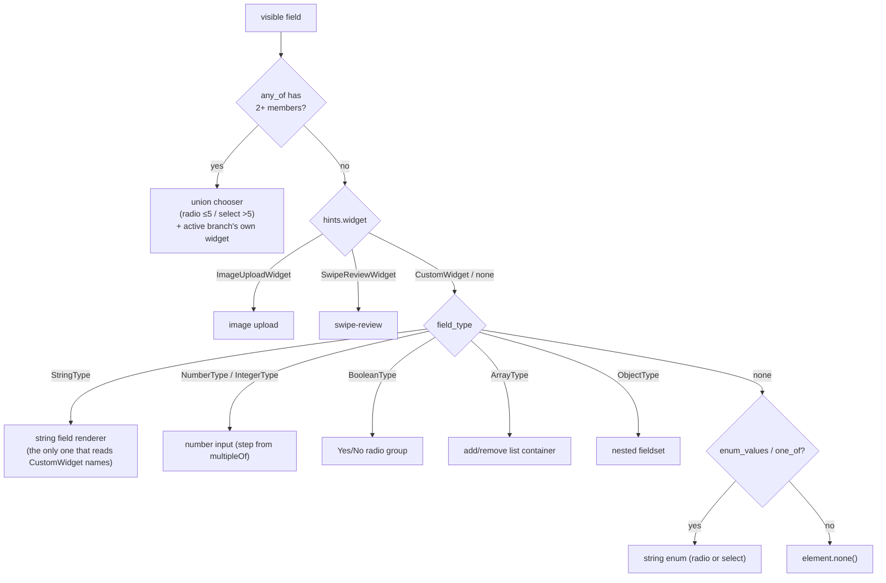
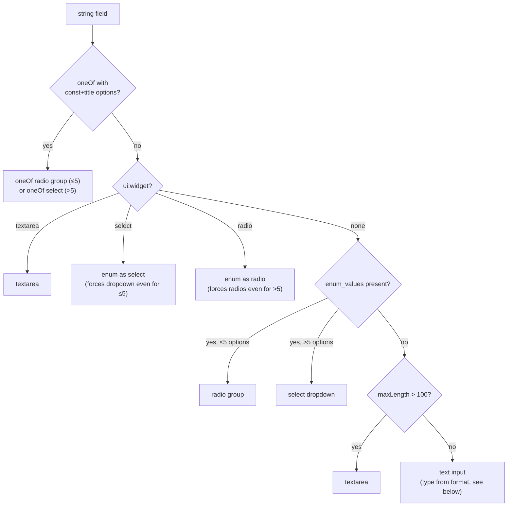

# Widget Selection

Formosh does not ask you to declare a widget per field. It picks one
automatically from the schema node's `type`, `enum` / `oneOf`, `format`,
and constraints. This page documents the decision tree and the two override
mechanisms (`ui:widget`, `x-widget`).

> **Source of truth.** The dispatcher is `render_widget` in
> `src/formosh/fields/field_dispatcher.gleam`; per-type logic is in
> `src/formosh/fields/string_field.gleam` and siblings. The merge of
> `ui:widget` and `x-widget` into a single `RenderHints` record happens in
> `src/formosh/schema/ui_resolver.gleam`.

## Selection priority

Hidden fields are filtered out *before* the dispatcher runs (the
suppression walker in `form/visibility` — the field still validates and
gates submit). For everything visible, `render_widget` decides:



Four consequences of this order:

- A 2+-member `any_of` **wins over everything else**, including
  `ImageUploadWidget` / `SwipeReviewWidget` hints on the same node — the
  `any_of` check runs before `hints.widget` is even inspected. See
  [Union chooser](#union-chooser-anyof-2-branches) below.
- `ImageUploadWidget` and `SwipeReviewWidget` overrides **always win** over
  the type-derived widget.
- `CustomWidget` names do **not** short-circuit dispatch — they ride along
  into the type-based renderer, and only the **string** renderer reads them
  (`"textarea"`, `"select"`, `"radio"`). `ui:widget: "textarea"` on a
  number field is silently ignored.
- If a property has no `type` but does have `enum` / `oneOf`, it still
  renders as a string enum (the fallback branch is how typeless enums work).

## String field rendering

Strings have the richest sub-decision, because `format`, `enum`, `oneOf`,
and `maxLength` all compete. From `string_field.render` →
`render_string_or_enum`:



### HTML input type from `format`

When a string renders as a plain `<input>`, its `type` attribute comes from
`StringFormat` (`string_field.get_input_type`):

| `format` | `<input type=...>` |
|----------|---------------------|
| `email` | `email` |
| `url` or `uri` | `url` |
| `date`, `time`, `datetime` | `text` — **native pickers not wired up** (see below) |
| `uuid`, custom, none | `text` |

The typed inputs are what get you the mobile-optimised keyboard.
`get_input_type` does carry `DateFormat`/`TimeFormat`/`DateTimeFormat` →
`date`/`time`/`datetime-local` mappings, but the parser's `format_decoder`
only ever produces `EmailFormat`, `UrlFormat`, `UuidFormat`, and
`CustomFormat` — so those date/time mappings are unreachable from a parsed
schema and the fields render as plain text (see `ROADMAP.md`).

## Number fields

A single number input. If `multipleOf` is set, it becomes the input `step`
attribute (with the tolerant `1e-8` comparison applied during validation —
see [Schema Keywords](schema-keywords.md#number-constraints)). `minimum` /
`maximum` / `exclusiveMinimum` / `exclusiveMaximum` are enforced but do
**not** become HTML attributes (validation runs in the update loop, not in
the browser).

## Boolean fields

Rendered as a Yes/No radio group, not a checkbox — the explicit No matters
for tri-state clarity. (A toggle renderer exists in `boolean_field.gleam`
but is not yet reachable via `ui:widget` — see `ROADMAP.md`.)

## Array fields

A list container with three optional controls, each gated by constraints
and UiSchema flags:

| Control | Shown when |
|---------|-----------|
| **Add** | `addable` (default true) **and** below `maxItems` (if set) |
| **Remove** | `removable` (default true) **and** above `minItems` (if set) |
| **Move up/down** | `orderable` (default true) **and** more than one row |

Rows auto-create up to `minItems` (with item-field defaults applied). Array
items can themselves be objects or arrays — nesting to any depth — so the
container recurses through the same dispatcher.

## Object fields

A nested `<fieldset>` with one labelled child per property. Child order is
preserved from the schema (`properties` is a `List`, not a `Dict`) but can
be overridden via `ui:order`. `readOnly` fields inside the object are
hidden unless `show_readonly_fields` is on.

## Union chooser (`anyOf`, 2+ branches)

A node whose `anyOf` survives composer normalization with 2+ non-null
members (see [Schema Keywords](schema-keywords.md#composition)) renders a
branch chooser (`union_field.render`) ahead of everything else in the
selection priority above. The chooser follows the same ≤5-radio / >5-select
threshold as `enum`, and takes the same override: `ui:widget: "select"` or
`"radio"` on the union's own path forces the style. Each option's label is
the branch's `title` — a `$ref` member without its own title inherits the
referenced `$defs` title — falling back to the capitalized JSON type name,
then `"Option N"` (1-based).

Picking a branch dispatches `SelectUnionBranchPath`. Switching to a
**different** branch clears the field's previous value, applies the new
branch's own defaults (scoped to that field's subtree only — other fields
elsewhere in the form are never re-hydrated), and re-renders that branch's
widget beneath the chooser through the same `field_type` dispatch as any
other field — so a branch can itself be an object, array, or nested union.
Inside an array row, switching a row's union resets only that row's value
(in place, not by removing the row) so sibling rows keep their index.
Re-selecting the branch that is **already active** — whether explicitly
chosen before or only active by inference — is a no-op: values, errors, and
touched state are left exactly as they were (a checked radio's `on_click`
fires even without a change, so this guards against silently wiping the
field on every redundant click).

With no explicit selection, the active branch is inferred from the current
value: first branch whose type matches (scalars), first branch whose
declared properties overlap the value's keys (objects), else branch 0. On
initial load, `apply_answers` (swipe-review), and component
re-initialization this inference is recomputed fresh every time and never
stored. A user edit (`UpdateFieldPath`/`ClearFieldPath`) inside an inferred
branch persists that inference the first time it fires, so clearing the
field that drove the inference doesn't snap the chooser back to branch 0.

A single non-null member alongside `{"type": "null"}` never reaches this
widget: composer normalization already collapsed it into a plain nullable
field before `field_dispatcher` sees it (see
[Web Component](../guides/web-component.md#nullable-fields) for what that
means for submission). A **bare** `anyOf` directly as an array's `items`
schema (no object wrapper) does not render a chooser — wrap the union in an
object property instead.

## Read-only (review) mode

When the whole form is in review mode (`read-only="true"` on the web
component — there is no library-side builder for it), rendering switches wholesale to
`readonly_field`: enums show their label, booleans show Yes/No, nested
objects render as groups, arrays of flat objects render as **tables**.
Submit/Reset are hidden. See [Styling](../guides/styling.md) for the
`readonly-*` part names.

## Override mechanisms

Two ways to force a widget other than the auto-selected one. Both produce
a `Widget` value that the dispatcher checks first.

### `ui:widget` (UiSchema) — recommended

Set `ui:widget` in the [UiSchema](ui-schema.md) parallel tree. This is the
primary mechanism from v0.7 onward and separates presentation from the
data schema:

```json
{
  "ui:widget": "textarea",
  "ui:placeholder": "Describe the issue…",
  "ui:help": "Be specific."
}
```

Recognised values: `"image-upload"`, `"swipe-review"`, `"hidden"`,
`"textarea"`, `"select"`, `"radio"`. Unknown values fall through as
`CustomWidget(raw)` so you can prototype without a parser change.

### `x-widget` (schema node) — deprecated fallback

The same idea as an extension field directly on the JSON Schema node:

```json
{ "type": "string", "x-widget": "textarea" }
```

Still works and is merged into the same `RenderHints.widget` slot, but
**prefer `ui:widget`** for new schemas — it keeps the data schema clean and
survives serialization round-trips more reliably. Upload-related extensions
(`x-accept`, `x-max-file-size`) follow the same pattern.

## Custom names and prototyping

`CustomWidget(String)` is the escape hatch. Anything you put in `ui:widget`
that isn't a recognised first-class variant becomes a `CustomWidget("…")`
and reaches the renderer as a plain string. The string renderers already
dispatch on three of these (`"textarea"`, `"select"`, `"radio"`); a custom
renderer can read `ctx.hints.widget` and do its own dispatch from there.

## Where to look in source

| Concern | File |
|---------|------|
| Top-level dispatch (widget → type → enum fallback) | `src/formosh/fields/field_dispatcher.gleam` |
| String sub-decision (oneOf / enum / textarea / input) | `src/formosh/fields/string_field.gleam` |
| HTML `type` from `format` | `string_field.get_input_type` |
| Array container + add/remove gating | `src/formosh/fields/array_field.gleam` |
| Object fieldset | `src/formosh/fields/object_field.gleam` |
| Union chooser (`anyOf`, 2+ branches) | `src/formosh/fields/union_field.gleam` |
| Branch resolution / materialization (`selected_branches`) | `src/formosh/form/union_resolver.gleam` |
| Image upload | `src/formosh/fields/image_field.gleam` |
| Swipe review | `src/formosh/fields/swipe_review_field.gleam` |
| Read-only rendering | `src/formosh/fields/readonly_field.gleam` |
| `ui:widget` + `x-widget` merge | `src/formosh/schema/ui_resolver.gleam` |
| Suppression decision (hidden / readonly) | `ui_resolver.is_suppressed` (shared with `form/visibility`) |
